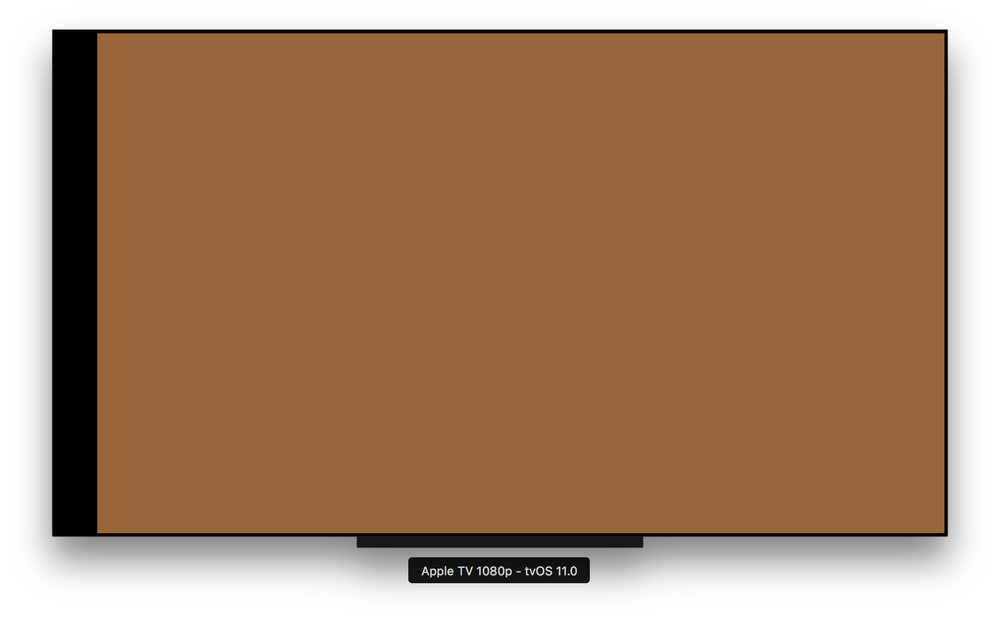

# Radar-33823598

Project created to report bug on UIPageViewController

· Open radar: https://openradar.appspot.com/33823598

# Description
When using UIPageViewController, with transition style Scroll, the first view controller is presented with a wrong left offset.

As soon as any gesture is triggered, the view adopts its expected layout.

# Expected 
The first view controller is presented without any offset.

# Steps

A project reproducing the problem can be found in this repo.

# Environment

- Xcode Version 9.0 beta 5 (9M202q)
- tvOS 11.0 (15J5347f)
